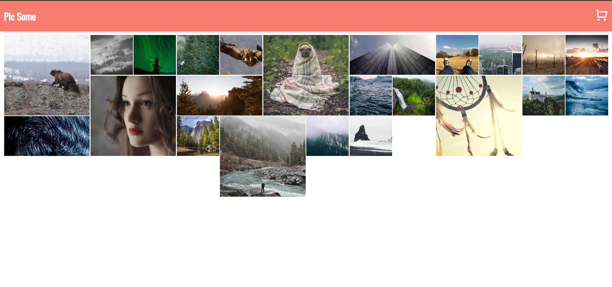
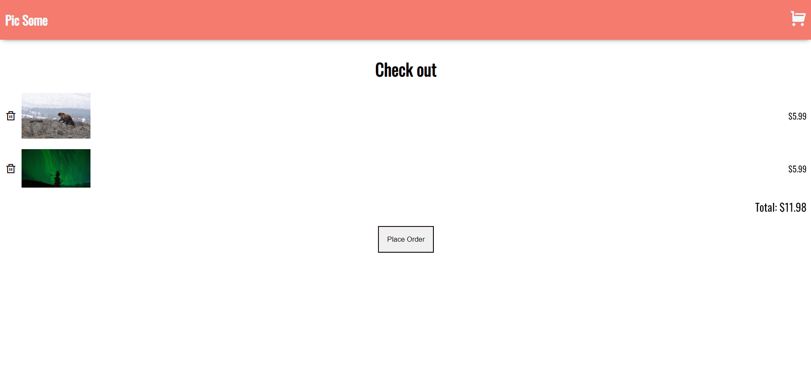

# Pic Some 🛒

<p align="center">

</p>


|  |  |
| :-----------------------------------------------: | :-----------------------------------------------: |

&nbsp;
&nbsp;

## Project Description

Simple frontend of an ecommerce of photos with home page and cart.

## How to run it locally

### Install

Clone this repository and install it dependencies with this command:

```
 npm install
```

### Running

Run the application with npm start command, it will start the app on localhost:3000:

```
 npm start
```

## :hammer: Project Functionalities

- `Functionality 1`: Add items to cart
- `Functionality 2`: Favorite items
- `Functionality 3`: Delete items from cart

## ✔️ Technologies and techniques used

- `React`
- `React Context`
- `React Hooks`
- `React Router`
- `Clean code`